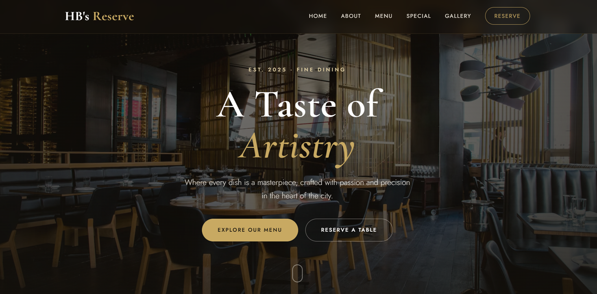

# HB's Reserve

A fine dining restaurant landing page built with pure HTML & CSS.

## 🚀 Live Demo
https://hbs-reserve.netlify.app

## 📸 Screenshot

## 🛠️ Built With
- HTML5
- CSS3 (custom properties, Grid, responsive design)

## ✨ Features
- Fully responsive layout across desktop, tablet, and mobile
- Themeable design using CSS custom properties (change one variable, update the whole palette)
- CSS Grid-based menu, gallery, and contact sections
- Smooth scroll navigation with a fixed, frosted-glass header
- Hover animations on cards, buttons, and gallery images

## 🏃 Getting Started

### Prerequisites
- A web browser (no dependencies needed — pure HTML/CSS)

### Installation
\`\`\`bash
git clone https://github.com/harshilbhojwani/hbs-reserve.git
cd hbs-reserve
\`\`\`
Then open `index.html` in your browser.

## 📚 What I Learned
Built as Sprint 1 of the GeeksforGeeks MERN course — this project taught me how to structure a multi-section landing page and use CSS Grid and custom properties for a maintainable, themeable design.

## 📝 Notes
Built as part of Sprint 1 (HTML & CSS Foundations) of the GeeksforGeeks MERN Full Stack course.